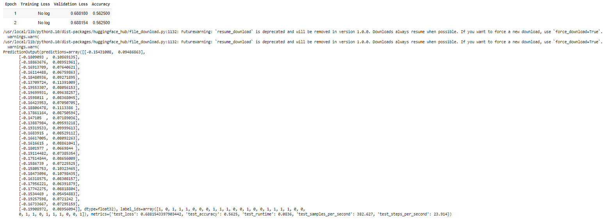
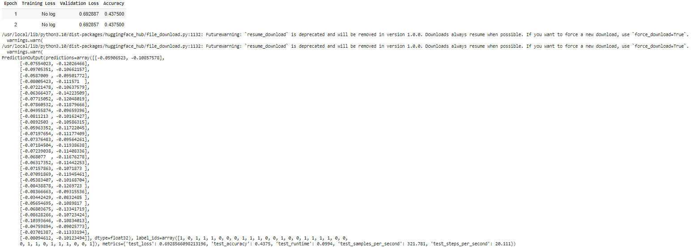
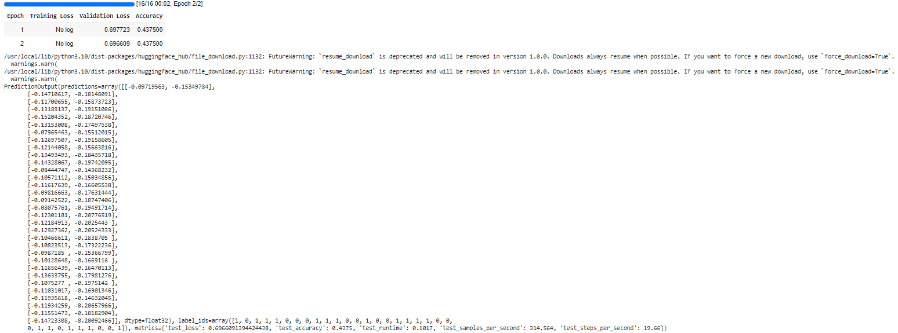

## hw7_1
#### 設定 LoRA 參數：
#### r=8
#### lora_alpha=16
#### lora_dropout=0.05
#### task_type="SEQ_CLS"
#### 指定 LoRA 作用層：
#### target_modules=["q_lin", "k_lin","v_lin"]

## hw7_2
#### 設定 LoRA 參數：
#### r=8
#### lora_alpha=16
#### lora_dropout=0.05
#### task_type="SEQ_CLS"
#### 指定 LoRA 作用層：
#### target_modules=["lin1", "lin2"]

## hw7_3
#### 用 IA3 進行 finetuning，參數：
#### task_type=TaskType.SEQ_CLS,
#### target_modules=["q_lin", "k_lin", "v_lin", "out_lin", "lin1", "lin2"],
#### feedforward_modules=["lin1", "lin2"]
#### optimizer：adamw_hf

# 環境建置
## 相關環境
[cuda](https://developer.nvidia.com/cuda-toolkit-archive) v11.6  
[cudnn](https://developer.nvidia.com/rdp/cudnn-archive) 根據cuda版本挑選  
[libtorch](https://pytorch.org/get-started/previous-versions/) 根據cuda版本挑選debug或release(測試使用 pytorch==2.1.0 pytorch-cuda=12.1 [下載連結](https://download.pytorch.org/libtorch/cu121/libtorch-win-shared-with-deps-2.2.1%2Bcu121.zip))  
## Visual Studio 2022 環境設置 (路徑皆須調整)
1. 開啟空白專案
2. 加入相關程式碼
3. 專案右鍵/屬性/一般/C++語言標準 : C++17
4. 專案右鍵/屬性/一般/C語言標準 : C17
5. 專案右鍵/屬性/VC++目錄/包含目錄
   C:\libtorch\libtorch-win-shared-with-deps-debug-2.2.1+cu121\libtorch\include\torch\csrc\api\include
   C:\libtorch\libtorch-win-shared-with-deps-debug-2.2.1+cu121\libtorch\include
(用debug x64 跑，但應該release也可)
6. 專案右鍵/屬性/VC++目錄/程式庫目錄
   C:\libtorch\libtorch-win-shared-with-deps-debug-2.2.1+cu121\libtorch\lib
7. 專案右鍵/屬性/連結器/輸入/其他相依性
   C:\libtorch\libtorch-win-shared-with-deps-debug-2.2.1+cu121\libtorch\lib\*.lib
8. 專案右鍵/屬性/連結器/命令列/其他選項
   /INCLUDE:"?ignore_this_library_placeholder@@YAHXZ"
9. 專案右鍵/屬性/建置事件/建置前事件/命令列
   xcopy /y /d "C:\libtorch\libtorch-win-shared-with-deps-debug-2.2.1+cu121\libtorch\lib\*.dll" "C:\source\repos\Project2\x64\Debug"

## 執行建置
